# About Me
My name is Tomer Hanochi, and I’m a passionate Software Engineer. I love diving into new technologies and solving esoteric problems.

I also maintain a blog at [tomerhanochi.com](https://tomerhanochi.com/blog), and you can contact me through [contact@tomerhanochi.com](mailto://contact@tomerhanochi.com).

# Projects
<a href="https://github.com/tomerhanochi/libsubid">
  <picture>
    <source
      srcset="./profile/pin-libsubid.svg"
      media="(prefers-color-scheme: light)"
    />
    
  </picture>
</a>
<a href="https://github.com/tomerhanochi/homelab">
  <picture>
    <source
      srcset="./profile/pin-homelab.svg"
      media="(prefers-color-scheme: light)"
    />
    
  </picture>
</a>
 
<a href="https://github.com/tomerhanochi/pytris">
  <picture>
    <source
      srcset="./profile/pin-pytris.svg"
      media="(prefers-color-scheme: light)"
    />
    
  </picture>
</a>
<a href="https://github.com/tomerhanochi/website">
  <picture>
    <source
      srcset="./profile/pin-website.svg"
      media="(prefers-color-scheme: light)"
    />
    
  </picture>
</a>

# Languages
<picture>
  <source
    srcset="./profile/top-langs.svg"
    media="(prefers-color-scheme: light)"
  />
  
</picture>
